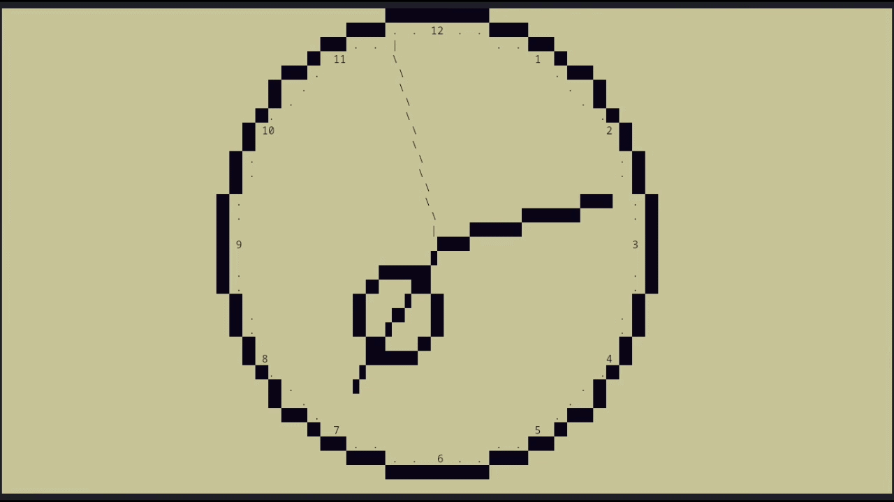

[](https://www.youtube.com/@MykhailoMosiychuk)
[](https://github.com/Myhajl-o/Terminal_Clock/releases)
[](https://github.com/Myhajl-o/Terminal_Clock/tree/rework#main-description)
[](https://github.com/Myhajl-o/Terminal_Clock/tree/rework#concept-meaning-philosophy-and-end-user)
[](https://github.com/Myhajl-o/Terminal_Clock/tree/rework#project-mechanics)
[](https://github.com/Myhajl-o/Terminal_Clock/tree/rework#project-structure)
[](https://github.com/Myhajl-o/Terminal_Clock/tree/rework#parsing)
[](https://github.com/Myhajl-o/Terminal_Clock/tree/rework#tests-and-build)

[](https://github.com/Myhajl-o/Terminal_Clock/tree/rework#top-bugs-of-all-time)
[](https://github.com/Myhajl-o/Terminal_Clock/tree/rework#the-future-of-the-project)
[](https://github.com/Myhajl-o/Terminal_Clock/tree/rework#technology-stack)


# Main Description

This project is a terminal utility. It displays a clock face, hands
(which are synchronized with the current system time), and a date window
(which can be hidden) in the terminal.
In other words, it replicates a real clock in the terminal with the added
bonus of a date window. Absolutely all terminal output is adaptive to the
current terminal size. You can change the output color to a custom one.
Furthermore, the adaptability and color changes work in real time, meaning
you don’t need to constantly close the program for the output to display
correctly. This utility also includes a configuration file where the user
can customize virtually anything. For example, you can change the character
used to form the object, adjust colors, and much more, as described below.
The project can be compiled and run on virtually any Windows system using
the Windows API, as well as on any Linux distribution. The project includes
its own libraries, which should not be used in other projects; some of them
are written in C. There are also UML diagrams to help you better understand
the project’s individual functions and how this utility works under the hood.


# Concept, Meaning, Philosophy, and End User

The main purpose of this utility is to provide a visually appealing and
flexible alternative to the boring standard time and date display in the corner
of the screen. Of course, this is a matter of personal preference, and more on
the end user will follow below. The utility imposes no restrictions and gives
the user plenty of freedom to be creative and design whatever they like. For
example, a user can specify settings in the configuration file that cause one
object to overlap another. This is done specifically to give the user more
freedom, but the configuration is still highly restricted to prevent the user
from breaking the utility. By design, it’s meant to run in the background at all
times. Therefore, it’s highly optimized to avoid overloading the CPU, and
everything within it refreshes every 100 milliseconds to keep the CPU load to a
minimum. This combination of user flexibility, convenience, and solid optimization
is a real plus. The utility offers not only user value but also intellectual
value. This is because the functions used under the hood (in the project’s
proprietary libraries) are either custom adaptations of mathematical functions
and algorithms in the code or reworked third-party logic tailored to specific
needs. This is precisely where the second value of this project lies: if someone
wants to understand, for example, how to implement Bresenham’s algorithm, they
can look it up in the project’s math library. This utility is ideal for those
who like to customize their system and experiment with non-standard, original
solutions for everyday tasks—or for those who enjoy being creative and finding
visually interesting solutions.


# Project Mechanics


### Keyboard Input

 * ‘c’ - sets the secondary color

 * ⬇️ or ‘s’ - displays the date window

 * ⬆️ or ‘w’ - hides the date window

### Flags

 * -help - displays all flags with descriptions

 * -static - static version of the utility; 
    the terminal is filled to 75% and the program exits

 * -name - displays the project name

 * -raw - displays the time and date


# Project Structure

```
Terminal_clock/
├── README.md
├── .gitignore
├── CMakeLists.txt
│
├── source/ 
│   ├── heart_clock.cpp
│   ├── watch_face.cpp
│   ├── bg_string.cpp
│   ├── backgound.cpp
│   ├── addition_functional.cpp
│   ├── Settings_clock.cpp
│   ├── Second-hand.cpp
│   ├── Minute-hand.cpp
│   ├── Hour-hand.cpp
│   └── Date_window.cpp
│
│
├── screenshots/
│   ├── tc1.png
│   ├── tc2...10.png
│   └── tc11.png
│
│
├── libreries/
│   ├── math.cpp
│   ├── parsing.c
│   ├── timedate.cpp
│   ├── win/
│   │   ├── output.c
│   │   └── input.cpp
│   └── linux/
│       ├── output.c
│       └── input.cpp
│
│
├── include/ 
│   ├── watch_face.hpp
│   ├── timedate.hpp
│   ├── parsing.h
│   ├── output.h
│   ├── math.hpp
│   ├── input.hpp
│   ├── bg_string.hpp
│   ├── background.hpp
│   ├── addition_functional.hpp
│   ├── Settings_clock.hpp
│   ├── Second-hand.hpp
│   ├── Minute-hand.hpp
│   ├── Hour-hand.hpp
│   ├── Date_window.hpp
│   ├── Coordinates.hpp
│   ├── Colors.h
│   └── Color_object.hpp
│
├── diagrams/
│   ├── main/
│   │   └── main.drawio
│   │
│   ├── math/
│   │   ├── arctan.drawio
│   │   ├── Coordinates_line.drawio
│   │   ├── Coordinates_degree.drawio
│   │   ├── Coordinates_circle.drawio
│   │   ├── Coordinates_update.drawio
│   │   └── Coordinates-degrees.drawio
│   │
│   └── parsing/
│       ├── parsing.drawio
│       └──main_parsing.drawio
│
├── configuration/
│   ├── error_conf
│   └── clock.conf
│
└── build/
    ├── lib_timedate_lib.so
    ├── lib_parsing_lib.so
    ├── lib_output_lib.so
    ├── lib_input_lib.so
    └── clock

```

# Parsing

### Syntax

'*' hello '*' - comment

'*' - a character that marks the beginning or end of a comment

= - a character that indicates a number will follow

'-' - a character that indicates the characters enclosed in quotes will be written

“<>” - a character set

" - a character used to denote characters that must be written

; - end-of-line character


### Rules

 * You cannot write any characters other than a space or a line break anywhere
 except within quotation marks or comments.

 * A number must follow the = symbol. The number can be 1 to 3 characters long.
 The number must not be a negative number or a fraction. A line-end symbol ';'
 must follow numbers.

 * The hyphen '-' must be followed by characters enclosed in quotation marks.
 You can enter 1 to 2 characters within the quotation marks. A line-break
 symbol cannot be entered within the quotation marks. A line-end symbol ';'
 must follow the characters within the quotation marks.

### Features

You can adjust the length along the x-coordinate of the clock.

You can flexibly set colors for any object.

You can change absolutely any characters displayed in the terminal.

You can offset the numbers on the clock face along the x-coordinate.

You can remove the decorative ring around the clock hand.

### Error Logging

If an error occurs while reading the configuration file, it will be logged to
the error_conf file, along with a full description of the error.


# Tests and build

 * arch linux - https://youtu.be/T07ebnZFw9o?si=wGcnoQKkafVm05l3

 * windows 10 - https://youtu.be/AYZ9I9sbEGo?si=hdLXDLdpCDwh5s-S

 * windows 7 64bit - 

 * windows 7 32bit - 


# Top Bugs of All Time

3. When I passed a single-byte variable to a function that only outputs a string,
an interesting situation arose. A trail of characters formed behind the second
hand because the program didn’t recognize the null terminator and kept reading
bytes from the stack until it encountered the null terminator.


2. For some reason, the filename and the ERROR macro on Windows conflicted with
something, and the error message wasn’t displayed.

1. When reading the configuration file on Windows, the program constantly threw
an error and automatically set the default settings. While investigating this bug,
it turned out that the first three characters read were apparently system characters
and had nothing to do with the configuration file.


# The Future of the Project

 * The plan is to make the project more cross-platform, so that it runs on both
   MS-DOS and Mac.

 * Create a full-featured calendar that allows users to navigate forward and
   backward by day using the right and left arrow keys or the ‘a’ and ‘d’ keys.

 * Add the ability to change the font style. For example, make the text bold or italic.

 * Rewrite the project from scratch and eliminate most system libraries.


# Technology Stack

This project uses

 * the C++98 standard

 * the C90 standard

 * CMake version 3.10

### AI WAS NOT USED AT ANY STAGE OF THE PROJECT'S DEVELOPMENT
